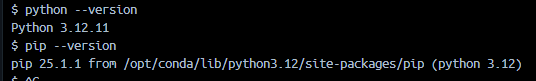

# Jupyter

單人使用`jupyter lab`，多人使用`jupyter hub`
> `jupyter lab`與`Classic Notebook (NbClassic)`經典筆記本不同，原定會取代筆記本，但因用戶過多且轉移不易，2021年決定開發升級版`Jupyter Notebook (Notebook 7)`<https://jupyter-notebook.readthedocs.io/en/latest/migrate_to_notebook7.html#why-a-new-version>

- [x] 選擇種類
  - [x] 自建
  - [x] 直接引用jupyter，但要選擇種類
    - <https://jupyter-docker-stacks.readthedocs.io/en/latest/using/selecting.html>
      - tensorflow-notebook:cuda-ubuntu-24.04
        - 會安裝 tensorflow，且支援的python版本超過官網說明的限制
          - Python 3.6–3.9 <https://www.tensorflow.org/install/pip?hl=zh-tw#system-requirements>
          - 實際
          - 
          > google 官網更新資訊比 github 慢<https://github.com/tensorflow/tensorflow>

## 實測環境

- 從 python 3.9 開始堆疊
  - <http://localhost:8888/?token=e625ffecdc048020360c6e408c45f9dbfc475f11aa19251ce1cf0b867fed39e3>
- 官方(jupyter lab)提供的 [tensorflow (google)](TensorFlow.md) 開發環境
  - <http://localhost:8889/?token=e625ffecdc048020360c6e408c45f9dbfc475f11aa19251ce1cf0b867fed39e3>
- 官方(jupyter lab)提供的 pyTorch (aws) 開發環境
  - <http://localhost:8890/?token=e625ffecdc048020360c6e408c45f9dbfc475f11aa19251ce1cf0b867fed39e3>

## WorkPath

驗證的腳本檔案會存放在`/home/jovyan`，`jovyan`是為了避免使用`root`而建立的帳號
> 誰是`jovyan`<https://jupyter-docker-stacks.readthedocs.io/en/latest/using/faq.html#who-is-jovyan>

### 特權

賦予`root`特權的環境參數`GRANT_SUDO`<https://jupyter-docker-stacks.readthedocs.io/en/latest/using/recipes.html#using-sudo-within-a-container>
